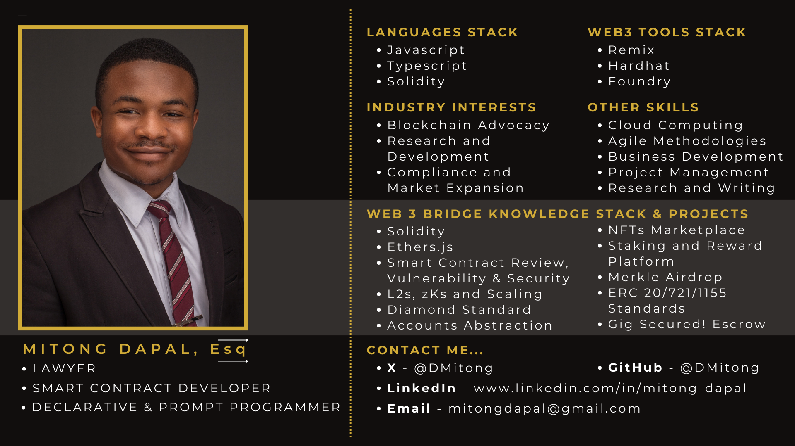

### Hi there 👋

I'm Mitong, a Lawyer💼 and a Blockchain Developer🕸️.

As a lawyer, my core areas of expertise are technology, commercial, corporate and regulatory law practice. I am passionate about the infusion of law and policy with technology to improve human personal and commercial relations, develop states, and improve government processes.

As a developer, I am enthusiastic about blockchain technology and its immense potential, the blockchain can help revolutionise how we interact on the web and with other technologies and I want to contribute to building that revolution.

I love learning and exploring new technologies, and I am always looking out for opportunities for self-improvement. Currently, I am learning the Rust lang as well as Zero Knowledge (zk) rollups.

### 🔗 How to reach me:

### Face Card:

<!--
**DMitong/DMitong** is a ✨ _special_ ✨ repository because its `README.md` (this file) appears on your GitHub profile.

Here are some ideas to get you started:

- 🔭 I’m currently working on ...
- 🌱 I’m currently learning ...
- 👯 I’m looking to collaborate on ...
- 🤔 I’m looking for help with ...
- 💬 Ask me about ...
- 📫 How to reach me: ...
- 😄 Pronouns: ...
- ⚡ Fun fact: ...
-->
